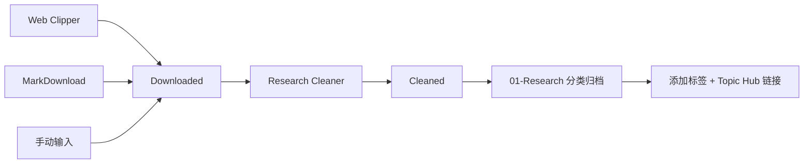

# Research Collection Workflow

## 完整流程

## 每日操作
1. 检查 `01-Inbox/Downloaded` 是否有新文件
2. 运行 Research Cleaner 处理新文件
3. 将清洗后的文件移入对应 Research 子目录
4. 更新 Topic Hub 索引

## 每周操作
1. 清空 `01-Inbox/Cleaned`
2. 检查孤立的 `Attachments`
3. 更新 Knowledge Graph 链接
